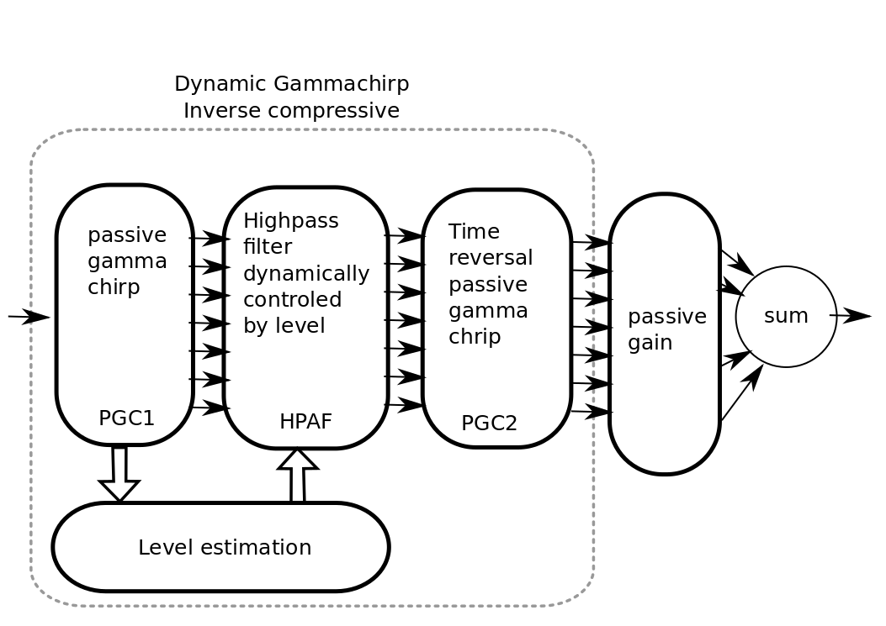

# HearingLossSimulator

This a near real time hearing loss simulator in python+opencl based on Compressive Gammachirp.

Compressive Gammachirp come from Irino, Patterson et al. long story.

The present code is not an exact port of matlab Irino's code but is is very similar.

It can be used offline (by scritting) or online (on close llop on the audio device).

The code need opencl to be installed and configured on the device.
This not so hard but not as easy to install as python stack.

The module come with a GUI for the online simulator:

The algorithm simulate both outer hair cell (OHC) loss and  inner hair cells (IHC) loss.
The OHC loss is simulated by a deficit in compression and IHC loss with a passive loss.

Here the block diagram of the algorithm:

Ref:
 * Irino,T. and and Patterson,R.D. : IEEE Trans.ASLP, Vol.14, Nov. 2006.
 * Irino T, Fukawatase T, Sakaguchi M, Nisimura R, Kawahara H, Patterson RD : Adv Exp Med Biol. 2013

