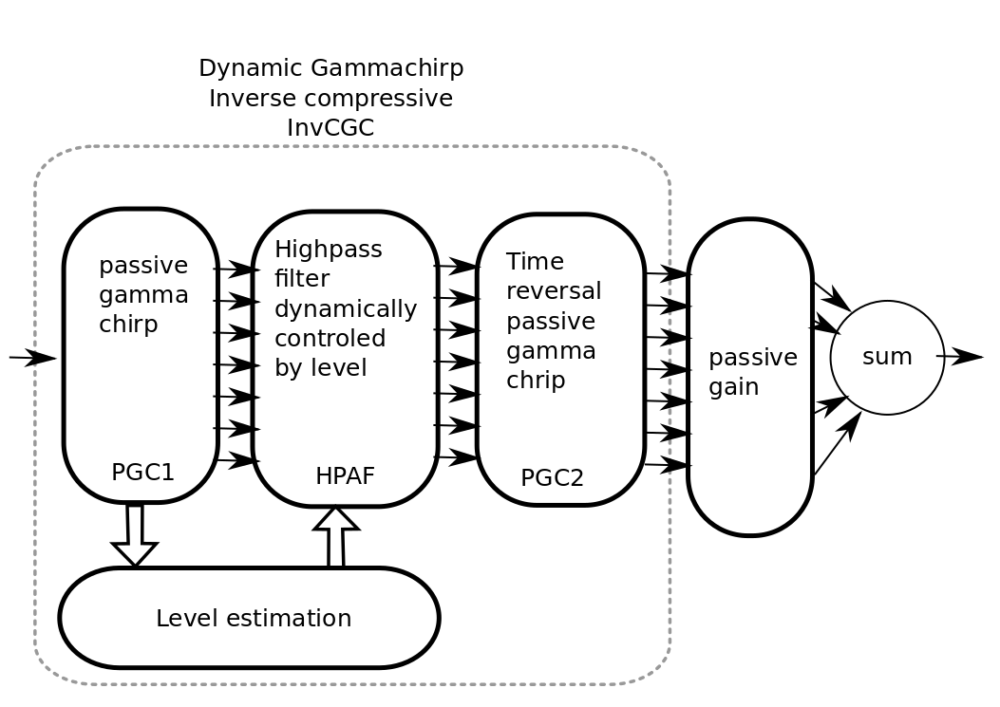
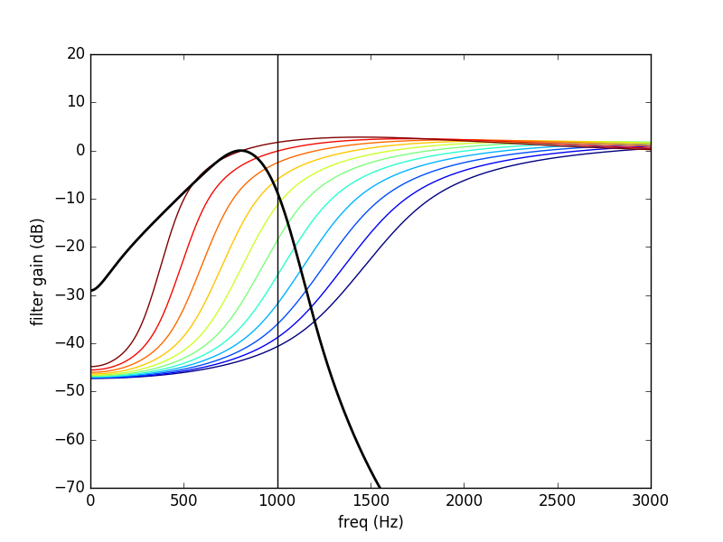
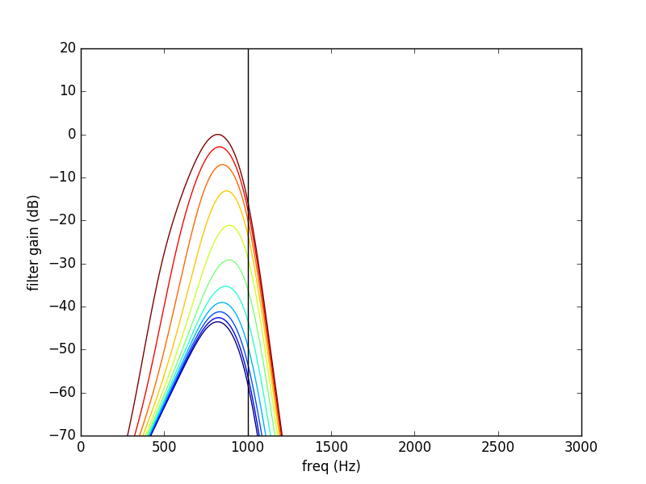
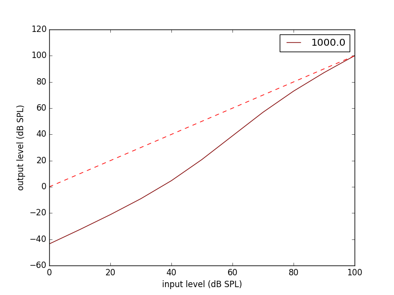
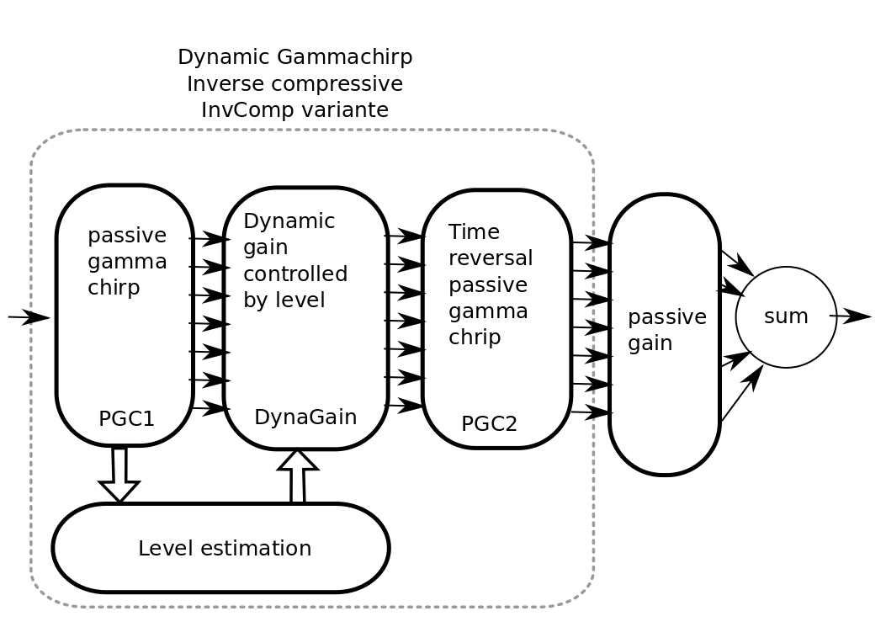
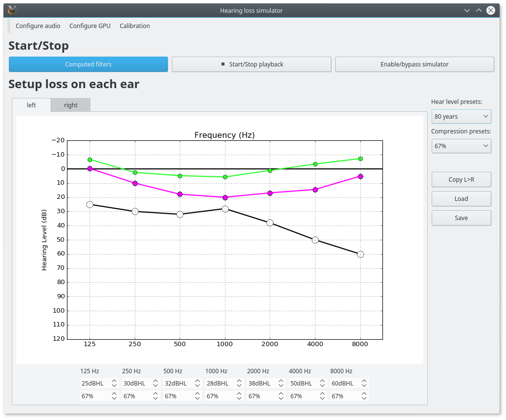

HearingLossSimulator
======================

Near real time hearing loss simulator in python based on an Inverse Compressive Gammachirp. 

This research was supported by the French National Research Funding Agency (CONTINT 2013, ANR-13-CORD-0001, project Aida)

Documentation:
   http://hearinglosssimulator.readthedocs.io/

Source code repository and issue tracker:
   https://github.com/samuelgarcia/HearingLossSimulator/

Python Package Index:
    Not done...
    
License:
   MIT -- see the file ``LICENSE`` for details.

Overview
--------

The original idea of the *Inverse Compressive Gammachirp* has been developed
by Toshio Irino, Roy Patterson et al.

This code is a transcription in Python of an original matlab code of Toshio Irino.
It is not an exact port but it is very similar.

The 2 main objectives of the actual recoding was:
  * to make the algorithm near real time.
  * to get an opensource version.

The aim of this module is to simulate an hearing impairement to:
  * demonstrate to normal listeners what a hearing loss is 
  * be used as a tool for sound designers to take into account hearing impairment
  * run experimental protocols with a simulated and controled hearing loss

It can be used:
  * offline in python script for testing the algorithm.
  * online (on close loop on the audio device).

The algorithm simulates both outer hair cell (OHC) loss and  inner hair cells (IHC) loss.
The OHC loss is simulated by a deficit in compression and IHC loss with a passive loss.

Installation
------------

There are 2 steps:
  1. install python and related stuff 3 cases here:
    * with anaconda (prefered on windows and OSX)
    * pip and virtualenvwrapepr (prefered on linux)
    * MacPorts and pip for OSX
  2. install opencl drivers themself many case:
    * windows with Intel GPU
    * windows with Nvidia GPU
    * linux with Intel GPU
    * linux with Nvidia GPU
    * OSX with Intel GPU

.. warning::
    OpenCL is a GPU language progamming. The central part of the simulator is done
    with OpenCL. While OpenCL is an open implementation, OpenCL drivers by themself
    are not opensource. You need to install the OpenCL drivers of your GPU device (and sometimes
    the OpenCL SDK) manually. On macOS, OpenCL is natively `installed <https://support.apple.com/en-us/HT202823>`_
    and no driver needs to be installed.

    

Step 1 - Case 1 : with anaconda (prefered on window or OSX)
+++++++++++++++++++++++++++++++++++++++++++++++++++++++++++

Do:

  1. Download anaconda here https://www.continuum.io/downloads. Take **python 3.6**
  2. Install it in user mode (no admin password)
  3. Launch **anaconda navigator**
  4. Go on the tab **environements**, click on **root** context menu.
  5. **Open Terminal** and do this::
    
       conda install scipy numpy cffi matplotlib
       conda install pyqt=5 jupyter
       pip install pyqtgraph==0.10 soundfile sounddevice

  6. Download PyOpenCl here for windows : http://www.lfd.uci.edu/~gohlke/pythonlibs/
  7. And do ::
  
       cd C:/users/...../Downloads
       pip install pyopencl‑2016.2.1+cl21‑cp36‑cp36m‑win_amd64.whl

  8. Finally::
  
       pip install https://github.com/samuelgarcia/hearingLossSimulator/archive/master.zip

       
Step 1 - Case 2 : with pip (prefered on linux)
++++++++++++++++++++++++++++++++++++++++++++++

In a terminal in Ubuntu 16.04 do::

  sudo apt-get install virtualenvwrapper python3.5-dev python3-tk
  mkvirtualenv hls   --python=/usr/bin/python3.5
  workon hls 
  sudo apt-get install portaudio19-dev 
  pip install scipy numpy matplotlib cffi jupyter PyQt5 pyqtgraph==0.10 sounddevice soundfile
  
  sudo apt-get install ocl-icd-libopencl1 ocl-icd-opencl-dev opencl-headers
  pip install pyopencl
  pip install https://github.com/samuelgarcia/hearingLossSimulator/archive/master.zip

Step 1 - Case 3 : MacPorts and pip for OSX
++++++++++++++++++++++++++++++++++++++++++

While this method works, the fact that it does not use virtualenv makes it *potentially harmful* to your machine,
so use wisely... Now this recipe assumes you have a working `MacPorts <https://www.macports.org/>`_ installation, with XCode activated, etc.

In a Terminal, do::

   sudo port install python35
   sudo port install py35-numpy py35-scipy py35-pyqt5 py35-pip py35-pyopencl
   
Once Python 3.5 installed, we need to tell that the default Python should be that one. To avoid messing up with the system :code:`python`, it is perhaps wise to stick to :code:`python3` (that's where it would be better to use virtualenv). To do this we do::

   sudo port select --set python3 python35
   sudo port select --set pip pip35

Then we are ready to install HearingLossSimulator::

   sudo -H pip install  https://github.com/samuelgarcia/hearingLossSimulator/archive/master.zip

If you are using Python 2.7 as your default Python, then we need to tell :code:`pip` to go back to 2.7::

   sudo port select --set pip pip27

Note: it may very likely also work with Python 3.6, but it has only been tested with Python 3.5.

Step 2 - Windows with Intel
+++++++++++++++++++++++++++

Go here https://software.intel.com/en-us/articles/opencl-drivers
and download the sdk developpement kit for windows.

Step 2 - Windows with Nvidia
+++++++++++++++++++++++++++

Go here https://developer.nvidia.com/opencl and download opencl drivers.

Step 2 - Linux with Intel
+++++++++++++++++++++++++++

Two possibilities:

  * The open source (sometimes bad perf)::
  
    sudo apt-get install beignet
  
  * The official intel:
  
    * go herehttps://software.intel.com/en-us/articles/opencl-drivers
    * download the sdk developpement kit for linux.

Step 2 - Linux with NVidia
+++++++++++++++++++++++++++

In a console::

   sudo apt-get install nvidia-opencl-icd-340

Step 2 - macOS / Mac OS X
+++++++++++++++++++++++++

The OpenCL drivers should already be installed. Check this page for the available version: https://support.apple.com/en-us/HT202823

Launch
------

Open a terminal and do::

  hls

Algorithm principle
-------------------

Toshio Irino and Roy Patterson et al. are the main contributors of the hearing loss simulator based on the compressive gammachirp model.

For more detail you should read at leat these references:
  * A dynamic compressive gammachirp auditory filterbank : Irino,T. and and Patterson,R.D. : IEEE Trans.ASLP, Vol.14, Nov.2006.
  * Accurate Estimation of Compression in Simultaneous Masking Enables the Simulation of Hearing Impairment for Normal-Hearing Listeners : Irino T, Fukawatase T, Sakaguchi M, Nisimura R, Kawahara H, Patterson RD : Adv Exp Med Biol. 2013
  * Hearing impairment simulator based on compressive gammachirp filter : Misaki Nagae, Toshio Irino, Ryuich Nisimura, Hideki Kawahara, Roy D Patterson : Signal and Information Processing Association Annual Summit and Conference (APSIPA), 2014 Asia-Pacific

.. note:: The orignal algorithm has evoluted along the last decade.
    The actual python/opencl version is a mixed of some of them!

.. note:: The very last version of Toshio Irino is now based on minimum phase filter for the synthesis part
    (the level estimation  part remains the same as before) : this has not been ported in python/opencl.

The main processing diagram is the following:

Steps:
  1. **PGC1** : The input sound is filtered by a bank of N passive gammachirp filter. N is typically 32.
  2. **Level estimation** : The instantaneous level is estimated in dB for each band. Sample by sample.
  3. **HP-AF** : A Highpass filter where the central frequency is dynamically controled by level.
  4. **PGC2** : Time reversal passive gammachirp. Identical to **PGC1**. This is used to cancel
     the phase delay induced by the PGC1 across frequency bands. This induced a delay for realtime.
  5. **passive gain** : provide an independent passive gain in each band.
  6. **sum** : sum all bands for resynthesis.

Steps 1, 2, 3, 4:  together are the inverse compressive gammachrip (**InvCGC**).
This model the outer hair cell (OHC) impairement by cancelling the natural compression.

Step 5: This step simulates a inner hair cells (IHC) loss with a static gain.

**As example here the 1000 Hz band:**

The PGC filter (in black) and HP-AF (color) levelled controled frequency response.
Blue is used for low levels and red is used for high levels.
Note that the **HP-AF** is moving from left (low, blue) to right (high, red).

The sum of the PGC1 + HP-AF + PGC2 is the InvCGC (Inverse Compressive Gammachirp).
Blue is used for low levels and red is used for high levels.
Note that for low level there is a negative gain. For high level, the gain tends to zero dB:

Here is the input/output inverse compressive gammachrip. It is than an expander.

We also design a variante of this diagram: **InvComp**. In **InvComp** HPAF is replaced  by a
dynamical gain controlled by the level. The input/output gain follow the same
law than the **InvCGC**.

Algorithm parameters
--------------------

The algorithm is done in the class `InvCGC`.
Fixed parameters like `nb_channel` or `sample_arte` are provided
at __init__ and all others parameters can be changed on the fly
(but not instantenaously) in `configure(...)`

.. automethod:: hearinglosssimulator.invcgc.InvCGC.__init__()
.. automethod:: hearinglosssimulator.invcgc.InvCGC.configure()

Calibration
-----------

A major parameter of the algorithm is the `calibration`.

The compression loss depends both of the `compression_degree` and of the real
level estimated in dBSPL in each band. Theses levels must then represent the true
levels otherwise the compression loss is not applied correctly.

By internal convention, the `calibration` parameter corresponds to the relation
between dBSPL_ and dBFS_:

.. math::
    
    Level_{dBSPL} = Level_{dBFS} + calibration

Where:
  * dBSPL_ is the value of the accoustic pressure
  * dBFS_ is the classical scale for digital sound representation
    where 0 dBFS is the maximum value of a sound which is limited by the sound device.
    As in many convention 0 dBFS is then a sinus with amplitude 1. Bounds are then [-1., 1].

    
.. math::

    Level = 20 log_{10}(p/p_0) dBFS

    
Where:
  * p is the root mean square of the signal
  * p0 is the reference (0 dBFS) = root mean square of sinus of amplitude 1.

.. math::
        
        p_0=1/sqrt(2)

    

.. note::

    For online simulation the sound is clipped by [-1., 1]. But for offline simulation 
    there is not such limitation so the calibration level is **NOT** the maximum 
    of the input sound. The algorithm itself does not clip.

If you want to play with signal that represents a real units of sound pressure in pascal (Pa),
it is easy. In that case a sinus with amplitude equal to 1 represents 1 Pa.
In SPL the 0 dBSPL is given for 20µPa. So for 1Pa the **true** dBSPL is:

.. math ::
    
    Level_{dBSPL} = 20 log_{10}(p/p_0) = 20 log_{10}(1/sqrt(2)/20e-5) = 90.97

So for **calibration=90.97**, the sound represents the **true** sound presure in pascal.

    

.. _dBFS: https://en.wikipedia.org/wiki/DBFS
.. _dBSPL: https://en.wikipedia.org/wiki/Sound_pressure#Sound_pressure_level

Implementation details
----------------------

  * All filters banks are computed in the time domain with IIR. So there is no window/overlap/add.
  * All processing are done sample by sample, even level estimation.
  * Practically, processing are applied on chunks (typically 512 samples) but
    there is no border effect since all filter states are kept for the next chunk. So chunksize
    does not affect the processing (only latency).
  * Filters are all biquadratic (more stable) = SOS (second order section)
  * Implementation of SOS is done with `form II`_.
  * Nmber of sections: 8 (PGC1) + 4 (dynamic HP-AF) + 8 (PGC2)
  * backward processing for PGC2 (time reversal) filter induces a delay.
    *delay=backward_chunksize-chunksize*. backward_chunksize affects the processing.
    If it is too small, it leads to distortion in low frequencies.
  * All HP-AF filters are precomputed for each band and each level before running.
    Filter coefficients are not computed on the fly.
  * Python/scipy is used for computing each filter (easy to debug)
  * OpenCl is used for applying filters (faster)
  * N sections for each channel are more or less computed in parrallel but performances
    depend of the GPU model.
    
    
.. _`form II` : https://en.wikipedia.org/wiki/Digital_biquad_filter#Direct_form_2

GUI
---

To start the main GUI::

    hls

You should see this:

On the top toolbar there is:
  * **configure audio**: this open a dialog box for chosing the good
    sound device for input and output. You can play a sinus sound
    to test the output. Be carreful with the sound level you use to avoid inducing a true hearing loss !!
  * **configure GPU** : this open a dialog box for choosing the GPU
  * **calibration** this dialog box provide help to set the correct `calibration` 
    parameter which is the relation between dbFS and dBSPL. See `calibration`.
    In this dialog box, you play on an output audio device a sinus with an internal level
    equals to -30dbFS (or what ever). Make a real measurement with a sound level meter.
    Report the measurement and the relation is automatically deduced.

On the bottom you can setup for each ear:
  * the **compression_degree** for each band. 100% means no compression loss
    0% means full compresison loss. This give you the magenta curve.
  * **hearing level** which you want to simulate. The black curve.

The passive loss between magenta and black curve is automatically deduced.

Before running with **play/stop** you need to compute at least once the filters.
This can take sevral second depending on the machine.

When running you can bypass the simulator.

You also recompute on the fly new filters.

On the left, there are some presets. And you can save/load your preset in json files.
Json files are easy to edit with a standart text editor.

Examples
--------

:doc:`examples`

API Documentation
-----------------

:doc:`api`

